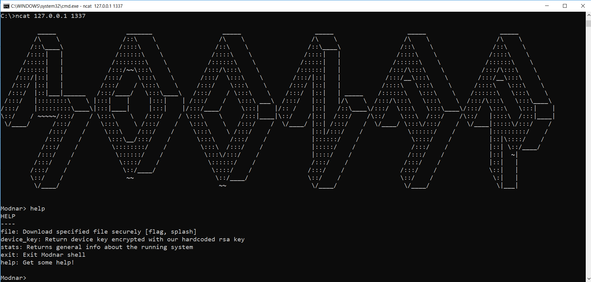
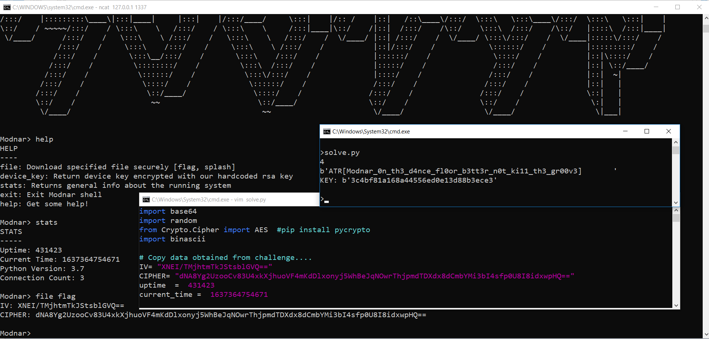

# Solution Write Up for 'Modnar'
# Expected Behavior

**Figure:** Help in Modnar.

# Solution

The idea of the challenge is the random number that is used to generate the AES Key is pseudo-random and seeded with the time of generation of the key. 

Conveniently the running challenge gives you current time and uptime (via the stats command) so you can guesstimate the generation time, and try incremental values until finding a key that will decrypt the flag. 

1. Retrieve the launch time of challenge by substracting the uptime to the current time provided by the server.
2. From there, try all the possible seed value to generate the key. 
3. Knowing the format of the flag, it is possible to check if the decryption was successful by comparing the result's first bytes with `ATR[`

## Supporting solution info

See [src/solve.py] for the solution. 
Replace `IV`, `CIPHER`, `uptime`, `current_time` by the values provided by the server. Note that `CIPHER` is the AES-encrypted blob.

### Expected output:

The script will try every possible generation time from 0 to 3000ms after the start time of the server. 
On success the script will print:
 - the moment relative to the server start when the key was generated
 - the decrypted flag
 - the recovered AES key

**Figure:** Solving the challenge

# Flag
**ATR[Modnar_0n_th3_d4nce_fl0or_b3tt3r_n0t_ki11_th3_gr00v3]**
