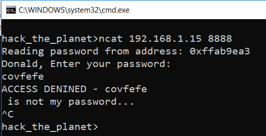
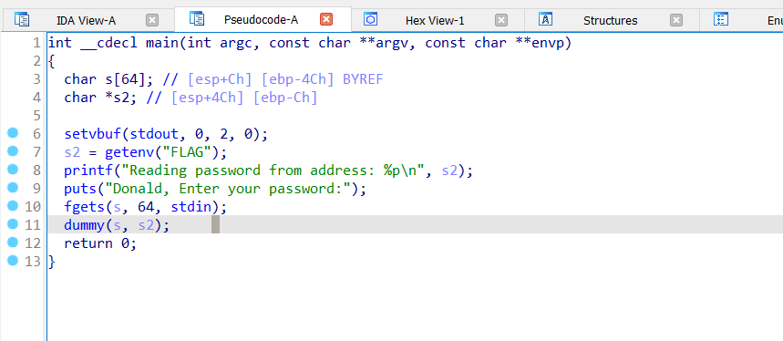
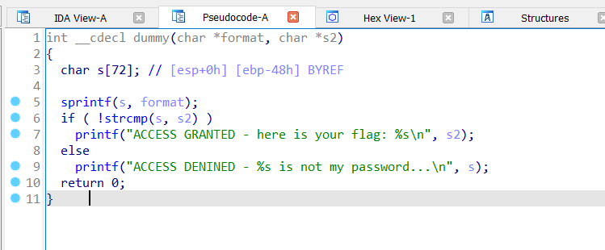
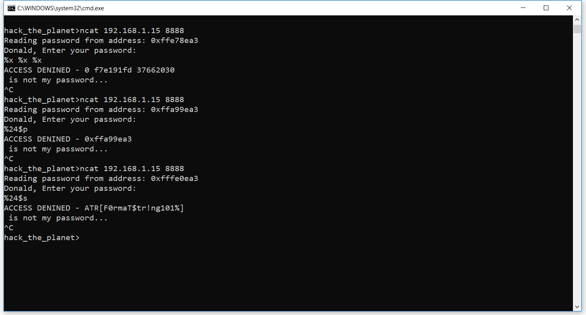
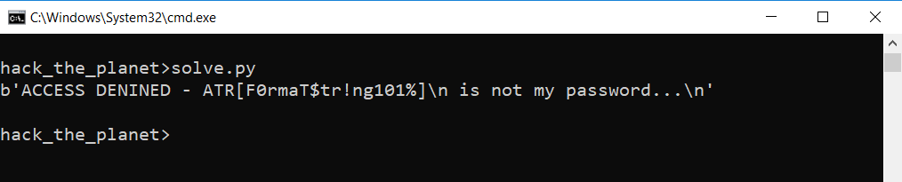

# Solution Write Up for '197IQ'
# Expected Behavior

\
**Figure:** Prompt when connecting.

# Solution

The idea of the challenge is to exploit a format string vulnerability. Indeed, if we open the binary in IDAPro and look at the pseudo-code, we can see the following: 

\
**Figure:** The main function.

The main function reads the flag from an environment variable, prints its address into the console, and then read the expected password from the user and pass it to a function called `dummy`. The `dummy` function does the following processing:

\
**Figure:** The `dummy` function, vulnerable to a string format vulnerability. 

We can see that the user input, called `format` here, is directly passed to the `sprintf` function. This is a vulnerable code pattern as the data is user-controlled and can contain format string. There is also a potential buffer overflow if the data, once formatted, exceed the size of the buffer `s` (which has a size of 72 bytes). 

A useful trick to know when handling format string vulnerabilities is that one can specify which argument on the stack they want to access using the `%XX$p` pattern where XXX is the parameter number (e.g., 12) and `p` is the format type we want to use (other could be `x`, `c`, `s`, etc.). Because of the way the `dummy` function was invoked, the address of the flag is still on the stack. We can either do math to figure out exactly at which location on the stack the address of the flag is located, or just trying each possible spot until the pointer (`%p`) returned matches the original address printed at startup.  In our case `%24$p` will do the trick. Then we can restart the program and use `%24$s` to display the actual string. The result looks as follow: 

## Supporting solution info

See [src/solve.py] for the solution. 
Replace `HOST` and `PORT` to match the server's details.

### Expected output:

The script will send the desired format string and print the flag. 

\
**Figure:** Solving the challenge

# Flag
**ATR[F0rmaT$tr!ng101%]**
