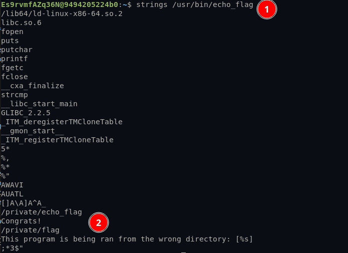
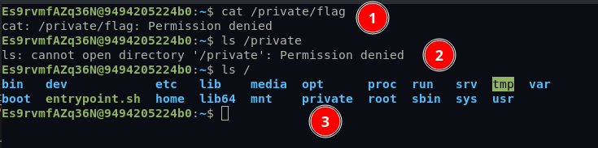
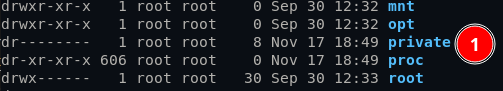
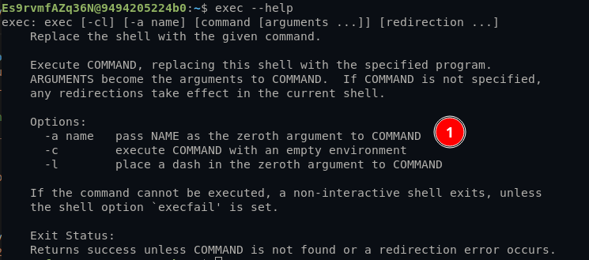
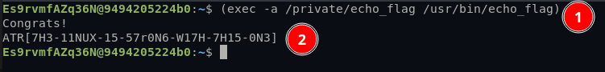

# Solution Write Up for 'Linux Houdini'
# Expected Behavior
This challenge creates a locked down linux user that can be used to ssh into the challenge server. From the description on the page where users are created it says you can echo out the flag using /usr/bin/echo_flag

When that command is ran the following is returned.

```bash
$ echo_flag
This program is being ran from the wrong directory: [echo_flag]
```

# Solution

1. This challenge just gives a url and a port to connect to. Using Netcat you can connect to the challenge with the following.
```bash
$ nc <hostname> <port>
```

2. Logging into the challenge server it seems as if we are just a normal user on the Linux server without sudo or anything. There is a prompt right as you login that says "the flag can be echoed out using /usr/bin/echo_flag", to get started.

3. Running the command "echo_flag" returns an error.
```bash
$ echo_flag
This program is being ran from the wrong directory: [echo_flag]
```
Seeing that the error returns that the executable is being ran from the wrong folder, it is probably necessary to either change directory to the correct one or somehow spoof it.
when running it with the full path the error shows a different argument.
```bash
$ /usr/bin/echo_flag
This program is being ran from the wrong directory: [/usr/bin/echo_flag]
```
So it seems that the binary is using argv0 in the error message.

4. To find the correct folder strings can be run on the /usr/bin/echo_flag file to see if anything is described there.\
\
**Figure:** Running "strings" on the binary shows some interesting paths starting in "/private"

5. Trying to "cat" or "ls" in this directory fails.\
\
**Figure:** Permission denied when trying to access anything in the "/private" folder.\
\
**Figure:** As expected the folder is only viewable by "root"

6. To change the argv0, exec with "-a" can help.\
\
**Figure:** Running help on exec shows that we can change the zeroth argument using the "-a" flag.

7. Running the exec command with the zeroth argument spoofing "/private/echo_flag" the flag is returned. The "()" around the command prevent the shell from exiting.\
\
**Figure:** Replacing argv 0 with "/private/echo_flag" returns the flag. 


# Flag
[//]: <> (Add the flag below)
**ATR[7H3-11NUX-15-57r0N6-W17H-7H15-0N3]**
