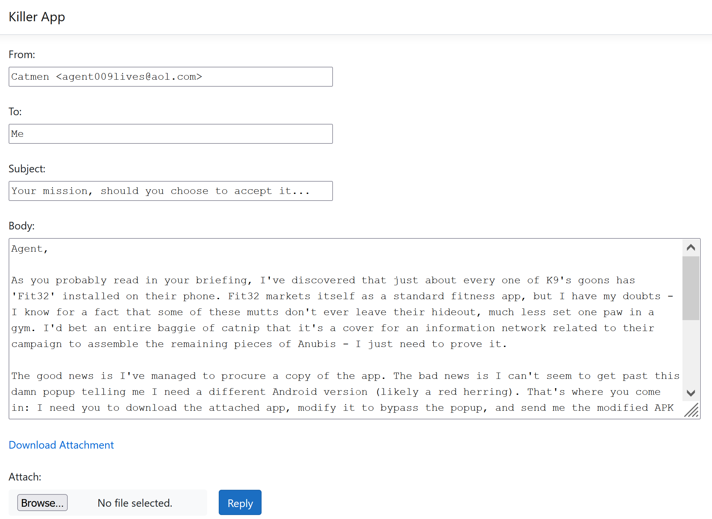
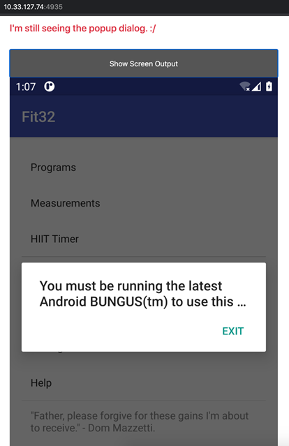
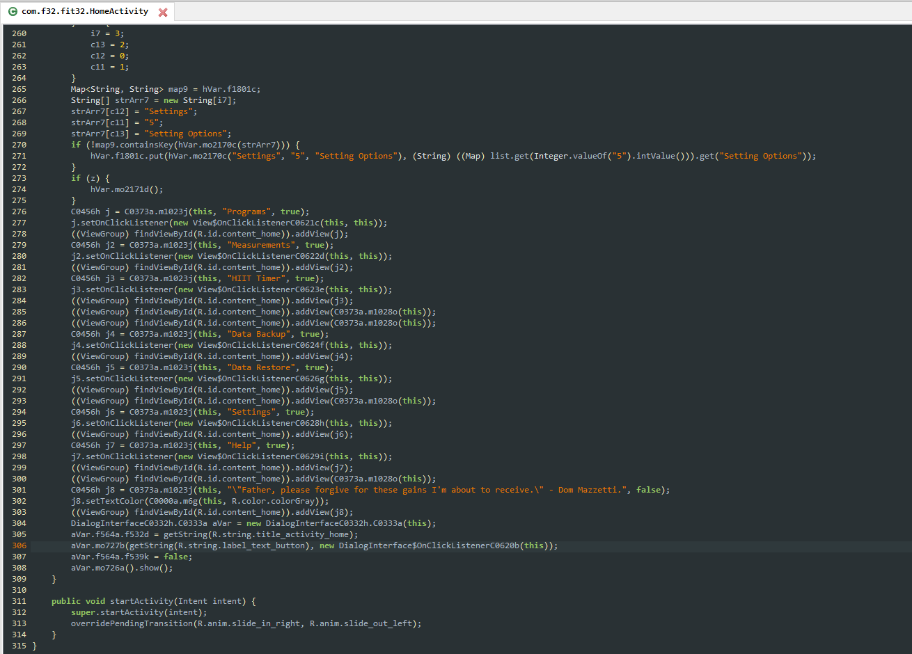
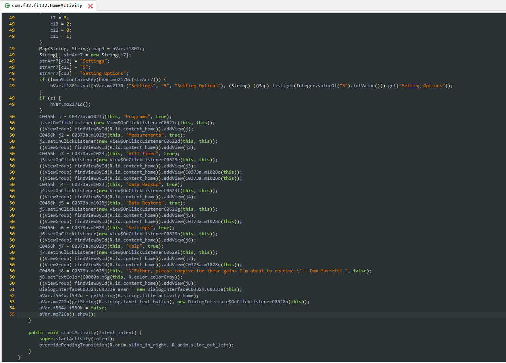
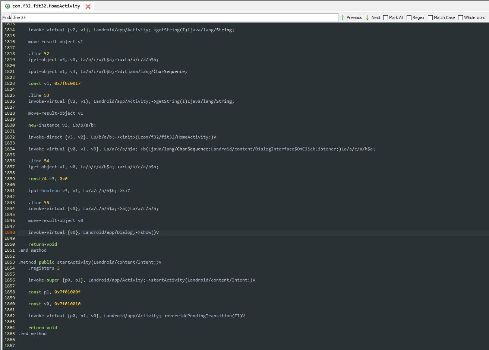
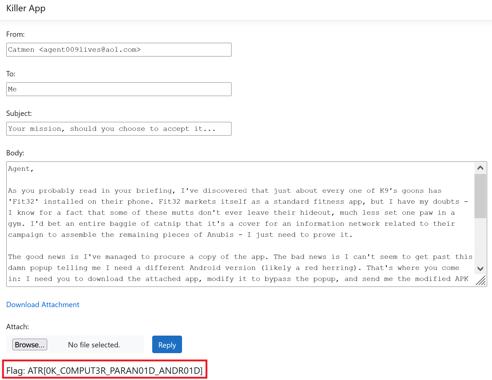

# Solution Write Up for 'Killer App'
## Expected Behavior
An android APK file is given with the request to remove a pop-up, as well as an online form where to submit the modified APK file.



## Solution
1. First, we download the provided attachment which contains the APK we're supposed to modify ([Fit32.apk](challenge/Fit32.apk)).
2. Submitting the given APK file unmodified into the form yields an error message as per below, as well as a screenshot of the Android app after it is run:

    
3. We use [`apktool`](https://ibotpeaches.github.io/Apktool/) to decompile the APK:
    ```bash
    $ apktool d Fit32.apk
    I: Using Apktool 2.5.0 on Fit32.apk
    I: Loading resource table...
    I: Decoding AndroidManifest.xml with resources...
    I: Loading resource table from file: /Users/rplacell/Library/apktool/framework/1.apk
    I: Regular manifest package...
    I: Decoding file-resources...
    I: Decoding values */* XMLs...
    I: Baksmaling classes.dex...
    I: Copying assets and libs...
    I: Copying unknown files...
    I: Copying original files...
    ```
4. From the screenshot we saw earlier, we know that the prompt we need to remove contains the word `BUNGUS`, so we perform a string search for this word in the extracted APK's files. The result shows that this word is associated with a value named `title_activity_home`:
    ```bash
    $ grep -R BUNGUS Fit32
    Fit32/res/values/strings.xml:    <string name="title_activity_home">You must be running the latest Android BUNGUS(tm) to use this app.</string>
    ```
5. Next, we perform a string search for this `title_activity_home` variable. The result shows that this variable has an ID of `0x7f0c0024`:
    ```bash
    $ grep -R title_activity_home Fit32
    Fit32/res/values/public.xml:    <public type="string" name="title_activity_home" id="0x7f0c0024" />
    Fit32/res/values/strings.xml:    <string name="title_activity_home">You must be running the latest Android BUNGUS(tm) to use this app.</string>
    ```
6. Next, we perform a string search for this ID, hoping to find the actual location in the disassembled smali code where the prompt text is used, which should lead us to the code responsible for drawing the prompt itself. The result shows that it is referenced in the `HomeActivity` class:
    ```bash
    $ grep -R 0x7f0c0024 Fit32
    Fit32/res/values/public.xml:    <public type="string" name="title_activity_home" id="0x7f0c0024" />
    Fit32/smali/com/f32/fit32/HomeActivity.smali:    const v1, 0x7f0c0024
    ```
7. Now that we know where to look, we next open the APK using the [JADX](https://github.com/skylot/jadx) Java decompiler and navigate to the HomeActivity class, finding that same reference to the `title_activity_home` string on line 306. It appears that the `aVar` object is the view responsible for displaying the prompt, as it first has what we know to be the prompt text assigned to it and then the `show()` method is called on it soon after, on line 306. Since we simply want to prevent the prompt from being displayed, removing this call to `show()` will likely suffice.
    
8. If we left click in the left margin, where the line numbers are, we can see which lines of decompiled code correspond with which `.line` directives in the smali code. From this, we know that the call to `show()` we wish to remove should be near `.line 55` in the smali code.
    
9.  If we change over to the smali view in JADX, done by clicking the "Smali" tab just below the code window, and perform a string search for `.line 55` via Ctrl+F, we quickly find the call to `show()` on line 1848:
    
10. Now that we know exactly what line of smali code needs to be removed, we open `Fit32/smali/com/f32/fit32/HomeActivity.smali` in our text editor of choice and simply delete this line and save our changes.
11. With our modification done, we next need to repack our APK, which we do via `apktool`:
    ```bash
    $ apktool b -f -d Fit32
    I: Using Apktool 2.5.0
    I: Smaling smali folder into classes.dex...
    I: Building resources...
    I: Building apk file...
    I: Copying unknown files/dir...
    I: Built apk...
    ```
12. Our modifications have invalidated the APK's original signature, so we must resign the APK before it can be installed by Brad. To accomplish this, we first generate a signing key using `keytool`, a binary included with any [JDK](https://openjdk.java.net/install/):
    ```bash
    $ keytool -genkey -v -keystore my-release-key.keystore -alias alias_name -keyalg RSA -keysize 2048 -validity 10000
    Enter keystore password:
    Re-enter new password:
    What is your first and last name?
      [Unknown]:
    What is the name of your organizational unit?
      [Unknown]:
    What is the name of your organization?
      [Unknown]:
    What is the name of your City or Locality?
      [Unknown]:
    What is the name of your State or Province?
      [Unknown]:
    What is the two-letter country code for this unit?
    [Unknown]:
    Is CN=Unknown, OU=Unknown, O=Unknown, L=Unknown, ST=Unknown, C=Unknown correct?
      [no]:  yes

    Generating 2,048 bit RSA key pair and self-signed certificate (SHA256withRSA) with a validity of 10,000 days
            for: CN=Unknown, OU=Unknown, O=Unknown, L=Unknown, ST=Unknown, C=Unknown
    Enter key password for <alias_name>
            (RETURN if same as keystore password):
    [Storing my-release-key.keystore]
    ```
13. Now that we have our key, we can use it to sign our modified APK via `jarsigner`, another binary included with the JDK:
    ```bash
    $ jarsigner -verbose -sigalg SHA1withRSA -digestalg SHA1 -keystore my-release-key.keystore Fit32/dist/Fit32.apk alias_name
    Enter Passphrase for keystore:
       adding: META-INF/MANIFEST.MF
       adding: META-INF/ALIAS_NA.SF
       adding: META-INF/ALIAS_NA.RSA
      signing: resources.arsc
    -------->%-------
           SNIP
    -------->%-------
      signing: AndroidManifest.xml
      signing: classes.dex
    >>> Signer
        X.509, CN=Unknown, OU=Unknown, O=Unknown, L=Unknown, ST=Unknown, C=Unknown
        [trusted certificate]

        jar signed.

    Warning:
    The signer's certificate is self-signed.
    ```
14. With our modified APK repacked and signed, all that's left to do is to attach it to our reply to Catmen:
    

## Supporting Solution Info
A working modified app can be found [here](solution/Fit32_Answer.apk).

When an APK is submitted, the server will actually install and run the submitted APK on an Android emulator. If the app successfully installs and runs, the objects drawn to the screen are fetched in XML format and parsed to determine if the prompt has been successfully removed and also that nothing else has been removed or modified. If your submission isn't a valid APK, is too large, fails to install, fails to run, fails to remove the prompt, or causes unwanted changes to the app, a corresponding error message will be displayed along with a screencap of the Android emulator's display (if available). These can be used to help debug your modified app if you run into problems, but since the error messages are fairly rudementary, it may be worthwhile to install your app onto an Android device or emulator using [ADB](https://developer.android.com/studio/command-line/adb) and debug it that way.

## Flag
**ATR[0K_C0MPUT3R_PARAN01D_ANDR01D]**