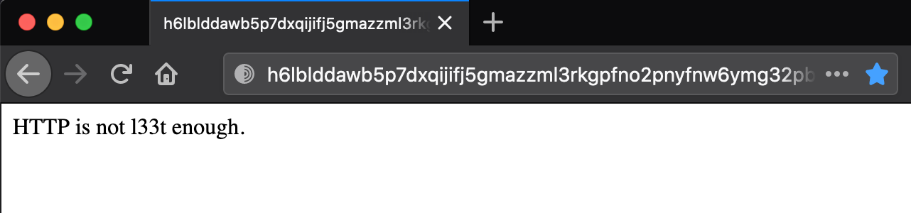

# Solution Write Up for 'hidden_services'
# Expected Behavior

# Solution
The challenger should see vegetable.txt with a series of characters. They eventually should realize that it's the base of an Onion URL accessable via tor, which of course is a vegetable. They need to use tor (such as the tor browser) to access this page for testing. However, this isn't the final answer.

h6lblddawb5p7dxqijifj5gmazzml3rkgpfno2pnyfnw6ymg32pbiuad.onion



**Figure:** This shows what the user would see if they accessed the URL via the tor browser

It leads them to the 1337 port. To interact with the 1337 port you can telnet under tor. One way to do that using ubuntu it to use "torify telnet h6lblddawb5p7dxqijifj5gmazzml3rkgpfno2pnyfnw6ymg32pbiuad.onion 1337". torify comes with the apt intall for tor. torsocks and other methods work too.

1. Load Ubuntu
2. Install Torify using by installing the tor proxy
3. $sudo apt install tor
3. Torify telnet to the onion address as the 1337 port
4. $torify telnet h6lblddawb5p7dxqijifj5gmazzml3rkgpfno2pnyfnw6ymg32pbiuad.onion 1337
5. Send "HELLO" to the service.

This is an example of a user tyring to use help, ls, test, dir, and ? before discovering the solution of 'HELLO'

Both 'hello' and 'HELLO' will work.


**Figure:** Notice the server will hint for them to say 'HELLO' after several communications.


## Supporting solution info
[//]: <> (Add your full sulution scripts as files if applicable or use this section here to add a code block.)
```bash
torify telnet h6lblddawb5p7dxqijifj5gmazzml3rkgpfno2pnyfnw6ymg32pbiuad.onion 1337
```
### Usage: ```torify telnet h6lblddawb5p7dxqijifj5gmazzml3rkgpfno2pnyfnw6ymg32pbiuad.onion 1337```

### Expected output:


**Figure:** The final output is the last two lines in the screenshot.

[//]: <> (Give an explination of the code and how to run it here. Make sure to explain the correct output so that anyone following allong can verify that it is running correctly.)
You need to say 'HELLO' to a tor service under the 1337 port. An easy way to do that is to use telnet but you must communicate over to. Torify, which is included with the tor proxy, will do that for you. The above command uses torify to tunnel telnet to the onion address at the 1337 port.

# Flag
[//]: <> (Add the flag below)
**ATR\[ch33s3cak3\]**
