# Solution Write Up for 'Skeleton Key'
# Expected Behavior
This challenge is a web vulnerability and reversing challenge, combined. The goal is for the user to unlock a piece of software by finding a "master" key.


```bash
You've recently stumbled across a web site for a piece of medical software you are interested in; unfortunately, you don't have a valid key to unlock the full features. Your challenge is to procure a key to unlock the full-featured software. The key itself is the flag - it should be placed inside of the text "ATR[]" between the square brackets when submitted.  The attached text file has a list of expired keys.

File: docker_skelly_apache_keygen_key_history.txt

Hint: "Dr. TRAV has worked hard to make sure all directories on this server are locked down and can't be accessed except for one - a logs directory, which you've probably found quite easily. Is there a way to access useful files in the directory, even if it appears to be restricted?
```

# Solution

The user is first presented with a 90s looking website.  Upon attempting to enter random data or a key provided in the file, the user is told they have entered an "invalid key."

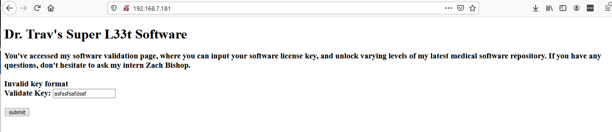

Upon further inspection of the website and its traffic the user can see a cookie is being used to pass in a php template header file.  This is a known potential condition for directory traversal.   This can be accomplished in many ways.  The easiest is to use the built-in developer tools in Firefox or Chrome.  Tools like Burp are also a great way to study website requests.  

NOTE: Directory traversal in the URL has been mitigated and is expected to fail.

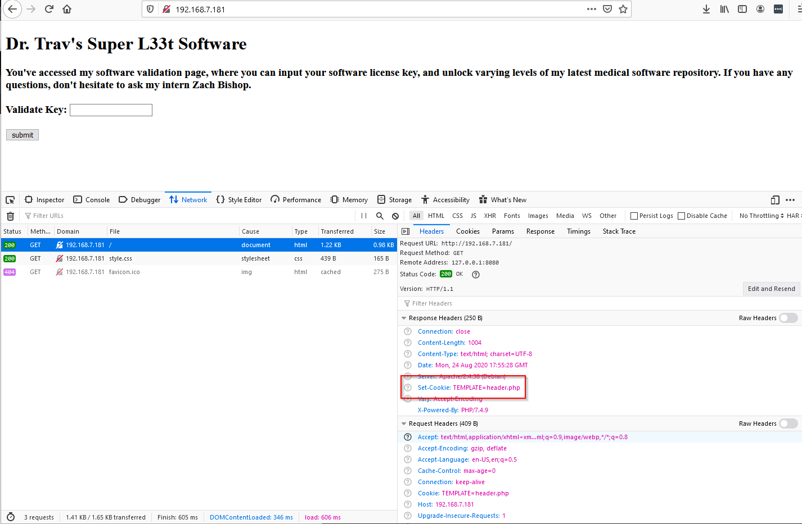

Upon testing this cookie, it can quickly be realized that directory traversal is possible by the error messages.  

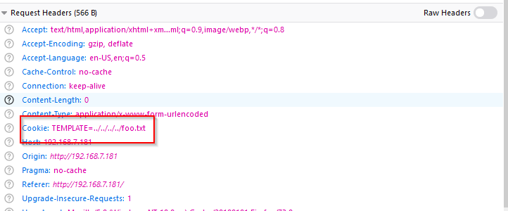
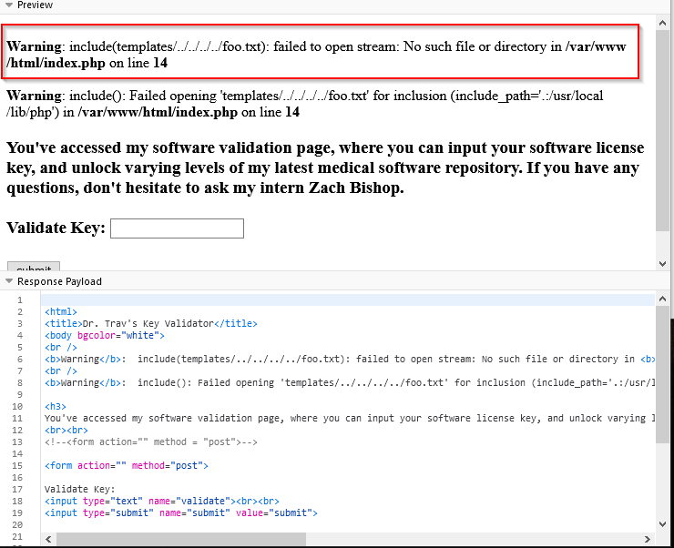

The question now becomes how do I use directory traversal to obtain the valid key?  The website is running a binary that validates the key,  We can, therefore, use directory traversal to obtain the binary and try to reverse the key.  But where is the binary?  Directory listing won't work since the php is using an include statement.   Logs are a man's best friend for directory traversal.  The binary checker has a log that can be accessed through the traversal.  The log path can be found two ways.  1) By examining the HTML source, they canfind out that the developer referenced a log file at /var/log/skeletonkey.log 2) Its standard practice for logs on Linux to record to /var/log.  The challenge is named Skeleton key, so it's a pretty easy guess as well.

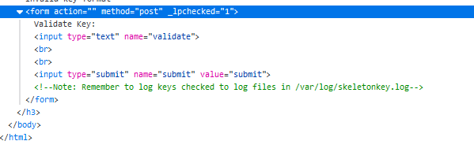

If we use the directory traversal vuln to examine the log we will gain more information - 

```bash
<html>
<title>Dr. Trav's Key Validator</title>
<body bgcolor="white">
key_checker program activated!
Current working dir: /var/www/keygen
Waiting for user input...
Master key found!
key_checker program activated!
Current working dir: /var/www/keygen
Waiting for user input...
Master key found!
key_checker program activated!
Current working dir: /var/www/keygen
Waiting for user input...
Invalid Key!
key_checker program activated!
Current working dir: /var/www/keygen
Waiting for user input...
Invalid Key!
 
<h3>
You've accessed my software validation page, where you can input your software license key, and unlock varying levels of my latest medical software repository. If you have any questions, don't hesitate to ask my intern Zach Bishop.
<br><br>
<!--<form action="" method = "post">-->
 
<form action="" method="post">
 
Validate Key:
<input type="text" name="validate"><br><br>
<input type="submit" name="submit" value="submit">
 
<!--Note: Remember to log keys checked to log files in /var/log/skeletonkey.log-->
 
</form>
 
</h3>
</body>
</html>
```

From the response we can see the binary is being run from "/var/www/keygen" and its name is "key_checker".  Now we can use the directory traversal to obtain a copy of the binary!  This will return the binary in the html response.

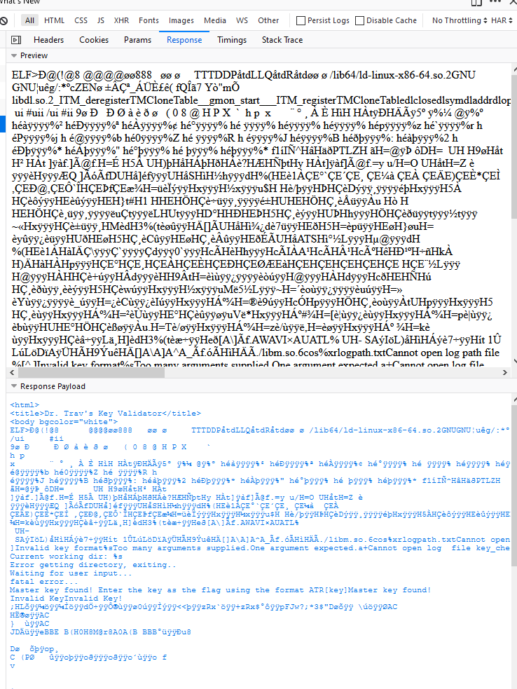

There are several ways to actually parse the binary out of the header.  One would be to use Wireshark to capture the traffic and export the binary.  Another would be to use BurpSuite or curl.  I used burp as shown below.  You can right-click and use "Copy to File" to create a binary file, in the hex view below.

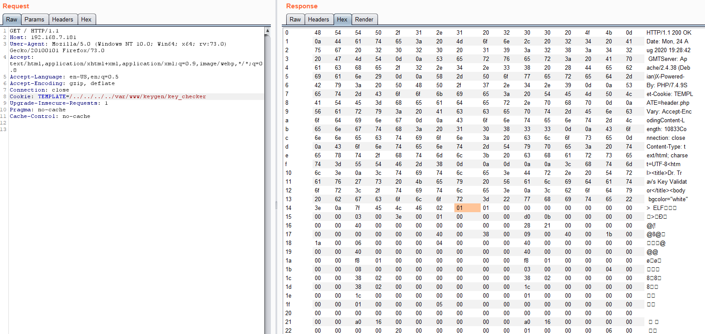

Once the binary has been extracted, basic analysis can start.  File shows us we have a 64-bit elf which is stripped.  Those assholes took symbols out! (wink)

```bash
24/08/2020 14:42.19  /home/mobaxterm/Desktop  file binary.bin
binary.bin: ELF 64-bit LSB shared object, x86-64, version 1 (SYSV), dynamically linked, interpreter /lib64/ld-linux-x86-64.so.2, for GNU/Linux 3.2.0, BuildID[sha1]=a67595ea672f8b9a3a87082aba635aad454e94f8, stripped
                                                                                                                                                                                 
 24/08/2020 14:42.26 /home/mobaxterm/Desktop
 ```

 Running strings gives us a place to start (I used IDA strings).  Two things pop out (not a flag)

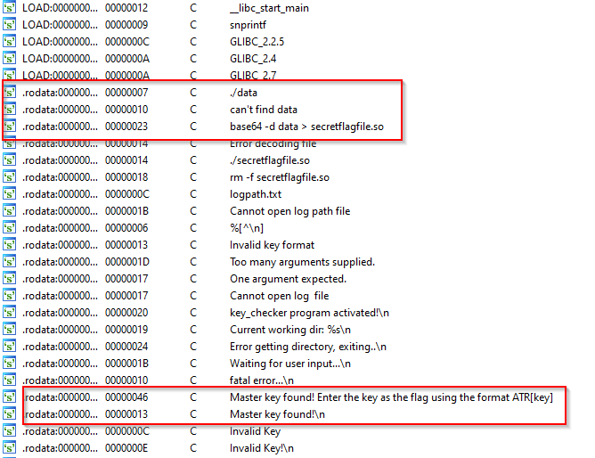

 If we look at the "Master key found" string reference in the code we can see a string compare which is determining the code path taken for valid and invalid keys.
 
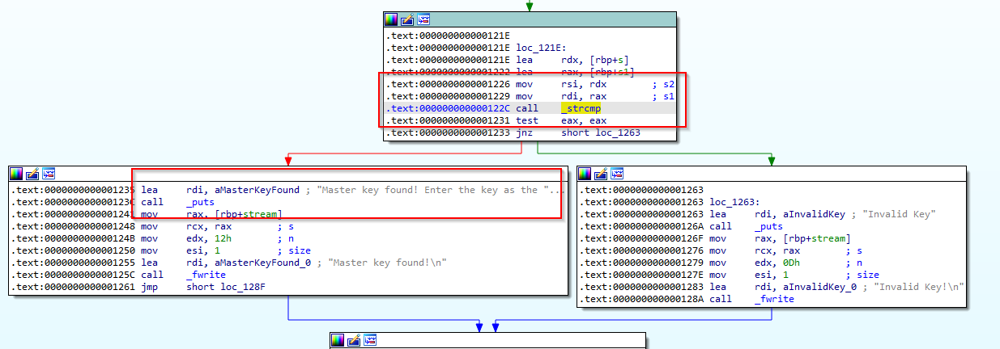

By either following the other string pointed about above or by looking at the function call before this string compare is called we land in function sub_D6A:

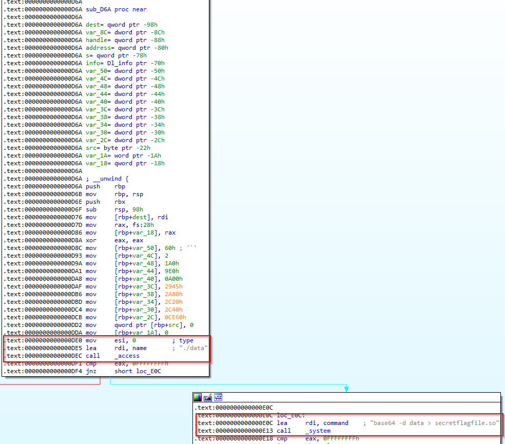

The key takeaways here is that a file "data" is being checked to exists from the same directory as the running key_checker binary.  We can then see that system is being used to base64 decode "data" into another shared object file.  This means we will need this shared object in order to run or obtain our valid key.  Since we know this binary is in the same directory as the key_checker, we can use the same technique (directory traversal to download the binary)  to acquire it from the server that we did for key_checker.  


Further reversing will show that this function, sub_D6A creates the master key out of binary data in "secertflagfile.so" and returns a string for the string compare found.  Therefore the easiest way to obtain the key is to put a breakpoint on the string compare and pull it from memory. We can easily do this with gdb.  Before running the binary the user will need to create have "data" and "logpath.txt" in the same directory,  which can easily be seen by error messages or reversing the binary.  They will also want to use a key that was given to them in the text file at the beginning to ensure they have the proper format.

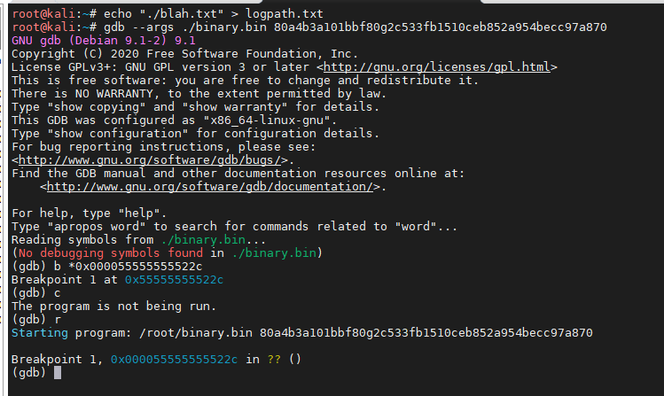

We know from IDA that the "strcmp" is at offset 0x1314 which can be added to the base address to know where to set the breakpoint.  We also know that rdi and rsi will contain the two strings being compared. (see screenshot above).  We then simply dump those registers knowing one will match our input and the other will be the flag.

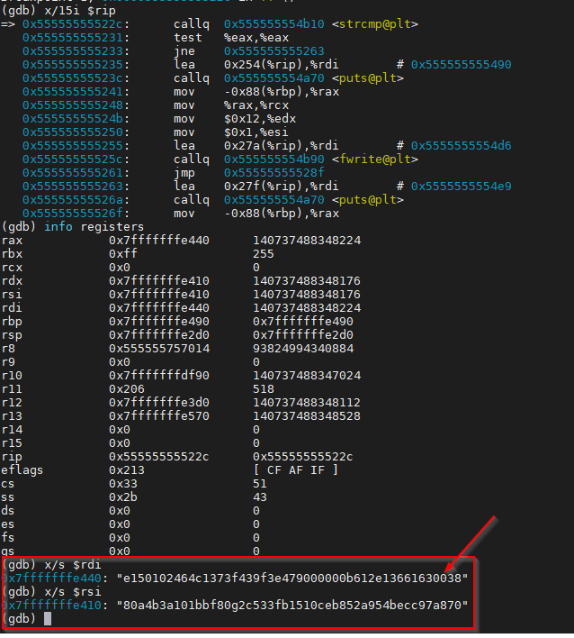

# Flag
[//]: <> (Add the flag below)
**ATR[e150102464c1373f439f3e479000000b612e13661630038]**
